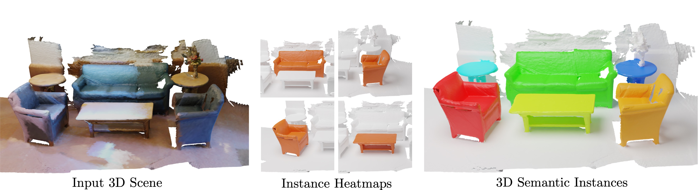

## Mask3D: Mask Transformer for 3D Instance Segmentation
<div align="center">
<a href="https://jonasschult.github.io/">Jonas Schult</a><sup>1</sup>, <a href="https://francisengelmann.github.io/">Francis Engelmann</a><sup>2,3</sup>, <a href="https://www.vision.rwth-aachen.de/person/10/">Alexander Hermans</a><sup>1</sup>, <a href="https://orlitany.github.io/">Or Litany</a><sup>4</sup>, <a href="https://inf.ethz.ch/people/person-detail.MjYyNzgw.TGlzdC8zMDQsLTg3NDc3NjI0MQ==.html">Siyu Tang</a><sup>3</sup>,  <a href="https://www.vision.rwth-aachen.de/person/1/">Bastian Leibe</a><sup>1</sup>

<sup>1</sup>RWTH Aachen University <sup>2</sup>ETH AI Center <sup>3</sup>ETH Zurich <sup>4</sup>NVIDIA

Mask3D predicts accurate 3D semantic instances achieving state-of-the-art on ScanNet, ScanNet200, S3DIS and STPLS3D.

[](https://paperswithcode.com/sota/3d-instance-segmentation-on-scannetv2?p=mask3d-for-3d-semantic-instance-segmentation)
[](https://paperswithcode.com/sota/3d-instance-segmentation-on-scannet200?p=mask3d-for-3d-semantic-instance-segmentation)
[](https://paperswithcode.com/sota/3d-instance-segmentation-on-s3dis?p=mask3d-for-3d-semantic-instance-segmentation)
[](https://paperswithcode.com/sota/3d-instance-segmentation-on-stpls3d?p=mask3d-for-3d-semantic-instance-segmentation)

<a href="https://pytorch.org/get-started/locally/"></a>
<a href="https://pytorchlightning.ai/"></a>
<a href="https://hydra.cc/"></a>



</div>
<br><br>

[[Project Webpage](https://jonasschult.github.io/Mask3D/)]
[[Paper](https://arxiv.org/abs/2210.03105)]
[[Demo](https://francisengelmann.github.io/mask3d/)]


## Code structure
We adapt the codebase of [Mix3D](https://github.com/kumuji/mix3d) which provides a highly modularized framework for 3D Semantic Segmentation based on the MinkowskiEngine.

```
├── mix3d
│   ├── main_instance_segmentation.py <- the main file
│   ├── conf                          <- hydra configuration files
│   ├── datasets
│   │   ├── preprocessing             <- folder with preprocessing scripts
│   │   ├── semseg.py                 <- indoor dataset
│   │   └── utils.py        
│   ├── models                        <- Mask3D modules
│   ├── trainer
│   │   ├── __init__.py
│   │   └── trainer.py                <- train loop
│   └── utils
├── data
│   ├── processed                     <- folder for preprocessed datasets
│   └── raw                           <- folder for raw datasets
├── scripts                           <- train scripts
├── docs
├── README.md
└── saved                             <- folder that stores models and logs
```

### Dependencies :memo:
The main dependencies of the project are the following:
```yaml
python: 3.10.9
cuda: 11.3
```
You can set up a conda environment as follows
```
# Some users experienced issues on Ubuntu with an AMD CPU
# Install libopenblas-dev (issue #115, thanks WindWing)
# sudo apt-get install libopenblas-dev

export TORCH_CUDA_ARCH_LIST="6.0 6.1 6.2 7.0 7.2 7.5 8.0 8.6"

conda env create -f environment.yml

conda activate mask3d_cuda113

pip install pyyaml==5.4.1 --no-build-isolation

pip install pycocotools

pip3 install torch==1.12.1+cu113 torchvision==0.13.1+cu113 --extra-index-url https://download.pytorch.org/whl/cu113
pip3 install torch-scatter -f https://data.pyg.org/whl/torch-1.12.1+cu113.html
pip3 install 'git+https://github.com/facebookresearch/detectron2.git@710e7795d0eeadf9def0e7ef957eea13532e34cf' --no-deps

mkdir third_party
cd third_party

git clone --recursive "https://github.com/NVIDIA/MinkowskiEngine"
cd MinkowskiEngine
git checkout 02fc608bea4c0549b0a7b00ca1bf15dee4a0b228
python setup.py install --force_cuda --blas=openblas

cd ..
git clone https://github.com/ScanNet/ScanNet.git
cd ScanNet/Segmentator
git checkout 3e5726500896748521a6ceb81271b0f5b2c0e7d2
make

cd ../../pointnet2
python setup.py install

cd ../../
pip3 install pytorch-lightning==1.7.2

pip install torchmetrics==0.11.4
```

### Data preprocessing
After installing the dependencies, please copy the opmotion data to `Mask3D/data/processed/opmotion`, the files should be organized as follows:
```shell
Mask3D # project root
├── data
│   ├── processed
│   │   ├── opmotion
│   │   │   ├── opmotion.h5
│   │   │   ├── data.json
```

### Training and testing
Train Mask3D on the opmotion dataset:
```bash
python main_instance_segmentation.py data/datasets=opmotion model.num_queries=10 data.batch_size=32
```

Test Mask3D on the opmotion dataset, the inference results will be saved out:
```bash
python main_instance_segmentation.py data/datasets=opmotion general.train_mode=false model.num_queries=10 general.checkpoint={path_to_ckpt_file} data.batch_size=32
```

## BibTeX
```
@article{Schult23ICRA,
  title     = {{Mask3D: Mask Transformer for 3D Semantic Instance Segmentation}},
  author    = {Schult, Jonas and Engelmann, Francis and Hermans, Alexander and Litany, Or and Tang, Siyu and Leibe, Bastian},
  booktitle = {{International Conference on Robotics and Automation (ICRA)}},
  year      = {2023}
}
```
